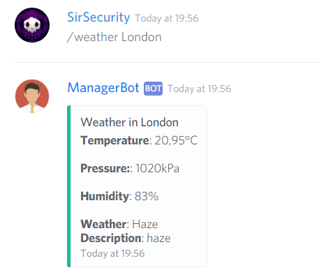

# API

## Find Girl Friend


@Manager\#9545 **findgirlfriend**



Generates random American girl



## Chuck Norris


@Manager\#9545 **chucknorris**



Sends a Chuck Norris joke



## Weather


@Manager\#9545 **weather &lt;town&gt;**



Sends weather forecast about a selected town


```text
@Manager#9545 weather Prague
```



## Random Picture


@Manager\#9545 **randomPicture &lt;width&gt; &lt;height&gt; &lt;params&gt;**



Bot sends a random picture.


```text
@Manager#9545 randomPicture 400 300 params
```


