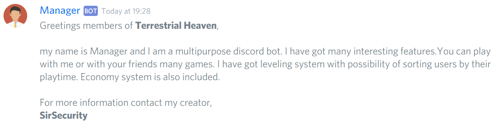
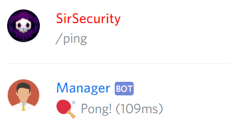
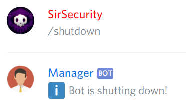
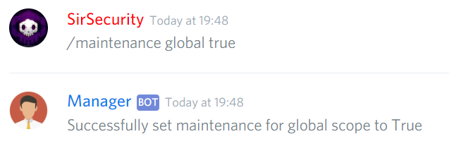
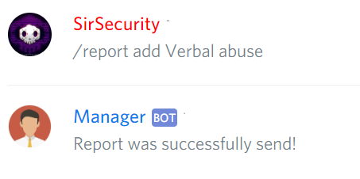
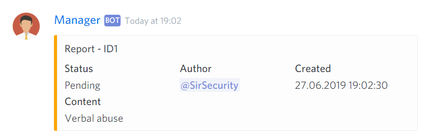
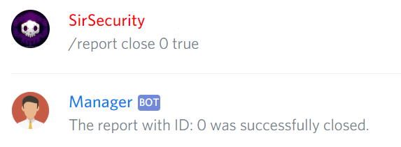
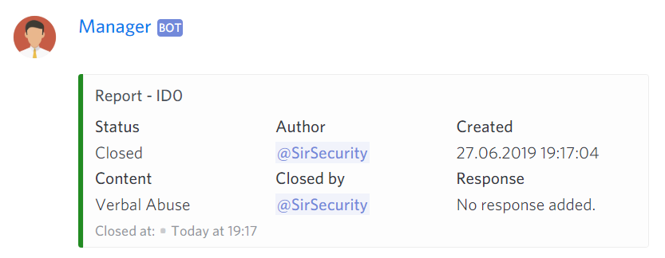
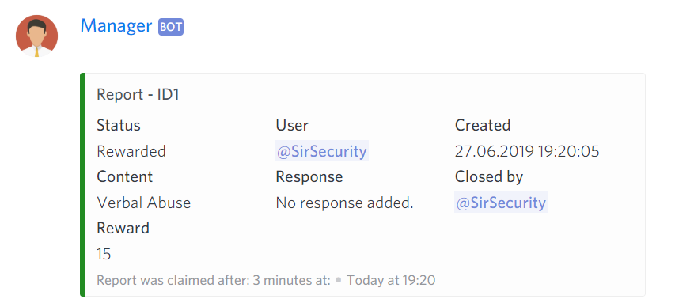

# Bot Moderation

## Bot Joined Message


@Manager\#9545 **botJoinedMessage &lt;textChannel&gt;**



Sends a welcome message


```text
@Manager#9545 botJoinedMessage
```



## Ping


@Manager\#9545 **ping**



Shows bot's Latency




## Shutdown


@Manager\#9545 **shutdown**



Shut downs the bot




## Maintenance


@Manager\#9545 **maintenance \[scope\] \[status\]**



Sets maintenance status


```text
@Manager#9545 maintenance global enabled
```



## Report

### Report Add


@Manager\#9545 **report add \[description\]**



Adds a report to a bug or an user


```text
@Manager#9545 report add Bot is not working.
```





### Report Close


@Manager\#9545 **report close \[reportId\] \[isValid\] &lt;response&gt;**



Closes the report


```text
@Manager#9545 report close 1 true
```





### Report Claim


@Manager\#9545 **report claim \[reportId\] &lt;amount&gt;**



Gives an user a reward for a reporting


```text
@Manager#9545 report claim 1 15
```




