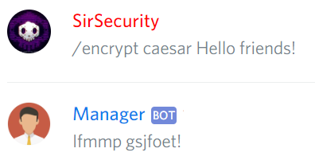

# Cryptography

## Encrypt

### Caesar


@Manager\#9545 **encrypt caesar \[plain-text\]**



Caesar's cipher encryption.


```text
@Manager#9545 caesar ABC
```



## Decrypt

### Caesar


@Manager\#9545 **decrypt caesar \[encrypted-text\]**



Caesar's cipher decryption.


```text
@Manager#9545 decrypt caesar DEF
```


