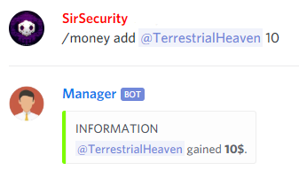
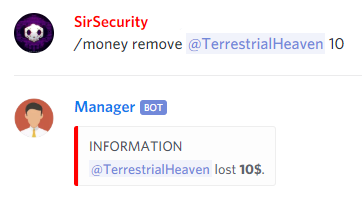
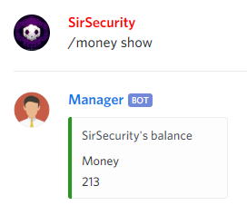

# Economy

## Buy

### Buy CustomRole


@Manager\#9545 **buy customRole**



Sells you a custom role which you can later edit.


```text
@Manager#9545 buy customRole
```

### Buy GuildRole


@Manager\#9545 **buy guildRole**



Sells you a guildRole which was set by guild Administrator.


```text
@Manager#9545 buy guildRole
```

## Money

### Money Add


@Manager\#9545 **money add \[user\] \[amount\]**



Adds player some amount of money.


```text
@Manager#9545 money add @SirSecurity#0959 10
```



### Money Give


@Manager\#9545 **money give \[user\] \[amount\]**



Gives user money.


```text
@Manager#9545 money give @SirSecurity#0959 10
```

### Money Remove


@Manager\#9545 **money remove \[user\] \[amount\]**



Removes player's amount of money.


```text
@Manager#9545 remove @SirSecurity#0959 10
```



### Money Show


@Manager\#9545 **money show &lt;user&gt;**



Shows how much money user has


```text
@Manager#9545 money show
```



### Money Top


@Manager\#9545 **money top &lt;count&gt;**



Shows the richest users on the server.


```text
@Manager#9545 money top
```


## Shop

### Shop Add

#### Shop Add CustomRole


@Manager\#9545 **shop add customRole \[price\]**



Enables custom role selling.


```text
@Manager#9545 shop add customRole 150
```

#### Shop Add GuildRole


@Manager\#9545 **shop add guildRole \[role\] \[price\] \[description\]**



Adds new guild role to shop


```text
@Manager#9545 shop add guildRole @PlayerRole 150 Player role
```

### Shop Remove

#### Shop Remove CustomRole


@Manager\#9545 **shop remove customRole**



Disables custom role creating.


```text
@Manager#9545 shop remove customRole @PlayerRole
```

#### Shop Remove GuildRole


@Manager\#9545 **shop remove guildRole \[role\]**



Removes selected guild role from shop


```text
@Manager#9545 shop remove guildRole @PlayerRole
```

## Shop Offer


@Manager\#9545 **shop offer**



Shows current shop offer.


```text
@Manager#9545 shop offer
```

## Shop Detail


@Manager\#9545 **shop detail \[itemId\]**



Shows detailed information of shop item.


```text
@Manager#9545 shop detail 123
```