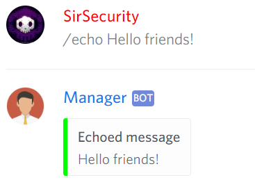
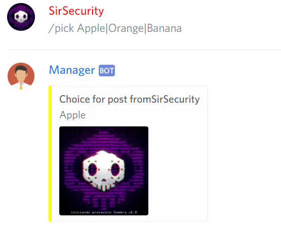
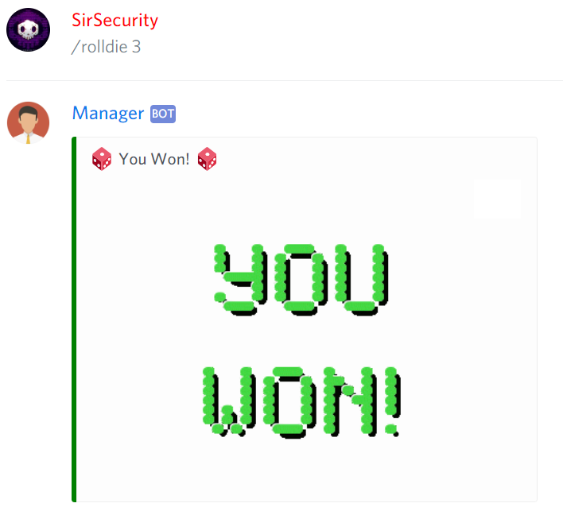
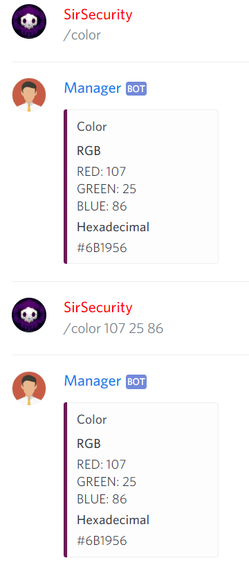
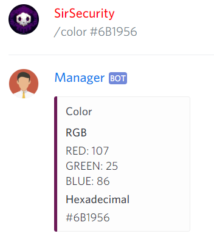

# Fun

## Echo


@Manager\#9545 **echo \[message\]**



Says something.


```text
@Manager#9545 echo Hello!
```




## Pick


@Manager\#9545 **pick \[message\]**



Randomly picks one of options.


```text
@Manager#9545 pick Apple|Orange|Banana
```




## Roll Die


@Manager\#9545 **rollDie \[number\]**



Rolls a die.


```text
@Manager#9545 rollDie 3
```



## Random Number


@Manager\#9545 **randomNumber &lt;min&gt; &lt;max&gt;**



Rock Scissors Paper Game


```text
@Manager#9545 randomNumber
```


## Rock Scissors Paper


@Manager\#9545 **rockScissorsPaper**



Rock Scissors Paper Game



## Flip A Coin


@Manager\#9545 **flipCoin**



Flip a coin game



## Math


@Manager\#9545 **math \[content\]**



Solves simple mathematical equations.


```text
@Manager#9545 math 5 + 5
```

## Color


@Manager\#9545 **color**  
@Manager\#9545 **color \[hexadecimal\]**  
@Manager\#9545 **color \[red\] \[green\] \[blue\]**



Generates random color or show you the color.


```text
@Manager#9545 color
@Manager#9545 color #00ffff
@Manager#9545 0 255 255
```



