# Guild Moderation

## Set Language


@Manager\#9545 **setlang \[languageShortcut\]**



Sets bot communicating language in the guild


```text
@Manager#9545 setlang ENG
```


## Prefix


@Manager\#9545 **prefix \[prefix\]**



Sets bot prefix in the guild



```text
@Manager#9545 prefix /
```

## Purge


@Manager\#9545 **purge \[messageCount\]**



Purges specified amount of messages in the text channel


```text
@Manager#9545 purge 10
```


## Boost Playtime


@Manager\#9545 **boost playtime \[value\]**



Sets playtime booster


```text
@Manager#9545 boost playtime 1.5
```


## Audit

### Audit Create


@Manager\#9545 **audit create \[channel\]**



Create new audit log configuration


```text
@Manager#9545 audit create #audit-channel
```

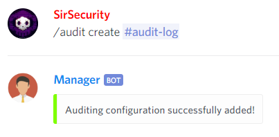

### Audit Remove


@Manager\#9545 **audit remove**



Removes audit configuration


```text
@Manager#9545 audit remove
```

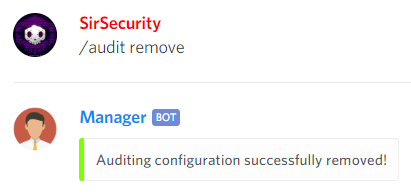

### Audit Channel


@Manager\#9545 **audit channel \[channel\]**



Changes the audit channel.


```text
@Manager#9545 audit channel #audit-channel
```

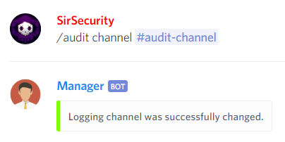

### Audit Modify


@Manager\#9545 **audit modify \[logType\]**



Modify log type value


```text
@Manager#9545 audit modify UserJoinedChannel
```

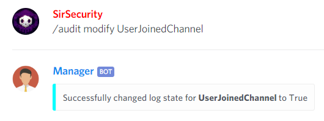

### Audit Value


@Manager\#9545 **audit value \[logType\]**



Gives you the true/false value of the state


```text
@Manager#9545 audit value UserJoinedGuild
```

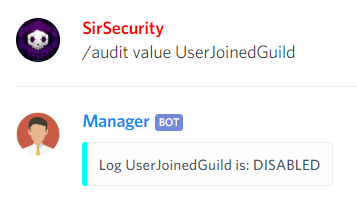

### Audit Values


@Manager\#9545 **audit values**



Gives you all the values of Log states


```text
@Manager#9545 audit values
```

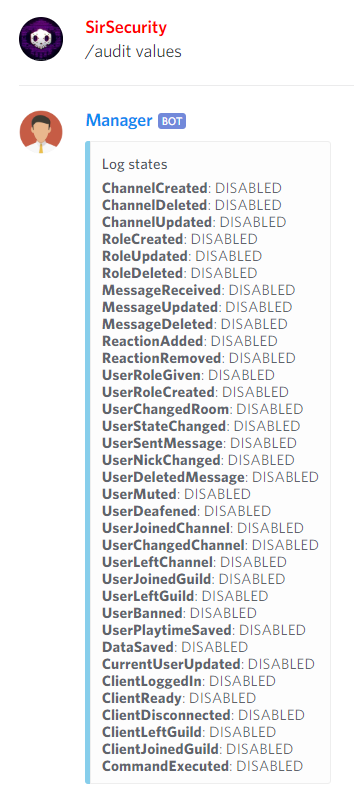

## Communication Channel

### Communication Channel Add


@Manager\#9545 **communicationChannel add \[channel\]**



Sets channel as bot communication channel


```text
@Manager#9545 communicationChannel add #channel
```

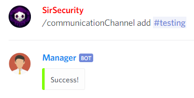

### Communication Channel Remove


@Manager\#9545 **communicationChannel remove \[channel\]**



Removes channel from bot communication channels


```text
@Manager#9545 communicationChannel remove #channel
```

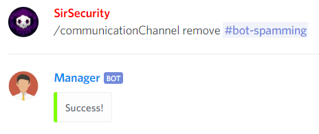

### Communication Channel Show


@Manager\#9545 **communicationChannel show**



Shows bot communication channels


```text
@Manager#9545 communicationChannel show
```

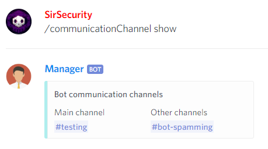

### Communication Channel Main


@Manager\#9545 **communicationChannel main \[channel\]**



Sets channel as a main bot communication channel


```text
@Manager#9545 communicationChannel main #channel
```

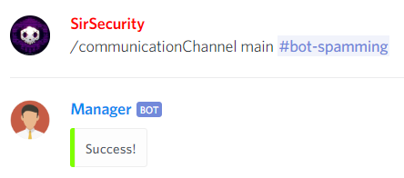

## Default Messages

### Default Messages Add

#### Default Messages Add Welcome


@Manager\#9545 **defaultMessages add welcome \[message\]**



Adds a welcome message for newly joined users


```text
@Manager#9545 defaultMessages add welcome Hello!
```

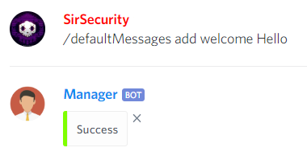

#### Default Messages Add Leave


@Manager\#9545 **defaultMessages add leave \[message\]**



Adds a leave message for newly joined users


```text
@Manager#9545 defaultMessages add leave "Bye!"
```

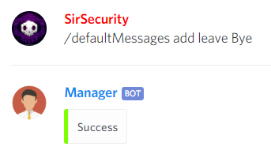

### Default Messages Remove

#### Default Messages Remove Welcome


@Manager\#9545 **defaultMessages remove welcome**



Removes a welcome message for newly joined users


```text
@Manager#9545 defaultMessages remove welcome
```

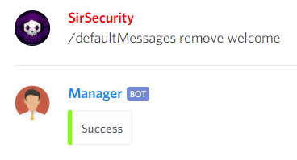

#### Default Messages Remove Leave


@Manager\#9545 **defaultMessages remove leave**



Removes a leave message for newly joined users


```text
@Manager#9545 defaultMessages remove leave
```

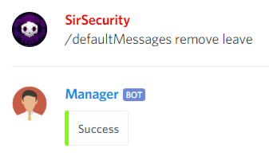

### Default Messages Show


@Manager\#9545 **defaultMessages show**



Shows welcome and leave messages


```text
@Manager#9545 defaultMessages show
```

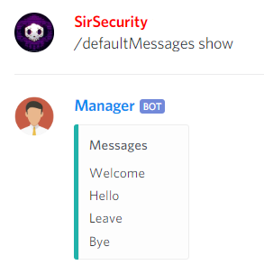

## Game Sales Notifications

### Game Sales Notifications Channel

#### Game Sales Notifications Channel Add


@Manager\#9545 **gamesalesnotifications channel add \[channel\]**



Adds a channel to post game sales notifications


```text
@Manager#9545 gamesalesnotifications channel add #channel
```

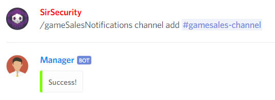

#### Game Sales Notifications Channel Remove


@Manager\#9545 **gamesalesnotifications channel remove**



Removes the channel from game sales notifications channel list


```text
@Manager#9545 gamesalesnotifications channel remove
```

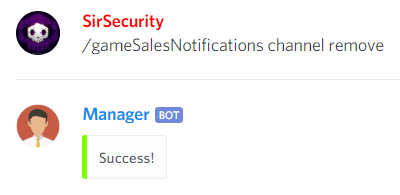

### Game Sales Notifications Role

#### Game Sales Notifications Role Add


@Manager\#9545 **gamesalesnotifications role add \[role\]**



Adds a role to sending notifications


```text
@Manager#9545 gamesalesnotifications role add @Role
```

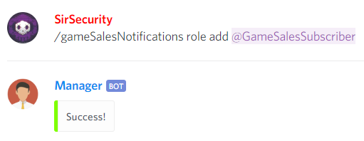

#### Game Sales Notifications Role Remove


@Manager\#9545 **gamesalesnotifications role remove**



Removes the role from game sales notification roles.


```text
@Manager#9545 gamesalesnotifications role remove
```

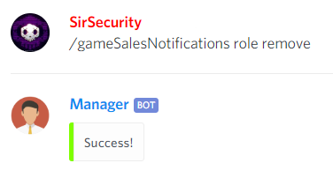

### Game Sales Notifications Show


@Manager\#9545 **gamesalesnotifications show**



Shows game sales notifications settings


```text
@Manager#9545 gamesalesnotifications show
```

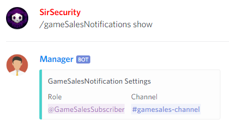

