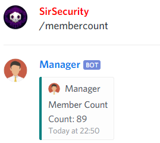
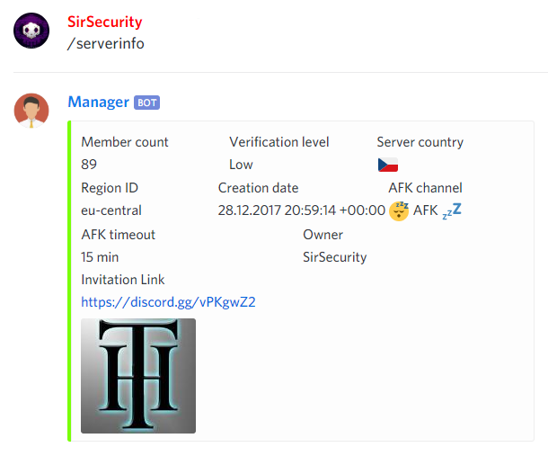
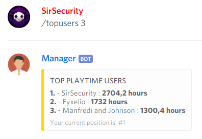

# Guild

## Invite


@Manager\#9545 **invite**



Sends a server invitation link



## Member Count


@Manager\#9545 **membercount**



Shows number of members in current guild


```text
@Manager#9545 membercount
```



## Server Info


@Manager\#9545 **serverinfo**



Shows server info


```text
@Manager#9545 serverinfo
```



## Top Users


@Manager\#9545 **topusers &lt;count&gt;**



Shows the best playtime users in a guild.


```text
@Manager#9545 topusers 3
```



