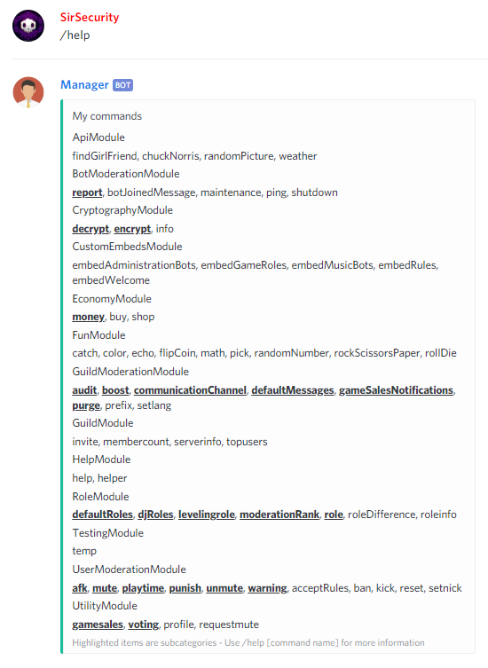
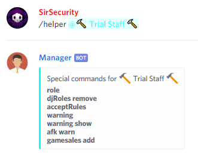

# Help

## Help


@Manager\#9545 **help \[command\]**



Shows help.


```text
@Manager#9545 help help
```



## Helper


@Manager\#9545 **helper \[role\]**



Shows a help for specific moderation ranks.


```text
@Manager#9545 helper @Staff
```



