# User Moderation

## Accept Rules


@Manager\#9545 **acceptRules &lt;user&gt;**



User confirms server rules


```text
@Manager#9545 acceptRules
```

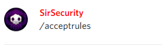

## Kick


@Manager\#9545 **kick \[user\]**



Kicks user out of server


```text
@Manager#9545 kick @SirSecurity#0959
```

## Ban


@Manager\#9545 **ban \[user\]**



Bans user in a server.


```text
@Manager#9545 ban @SirSecurity#0959
```

## Set Nick


@Manager\#9545 **setnick \[nick\]**  
@Manager\#9545 **setnick \[user\] \[nick\]**



Set user's nickname


```text
@Manager#9545 setnick Quentin
```

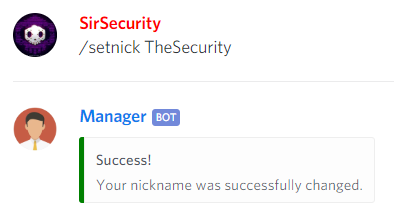

## Reset Profile


@Manager\#9545 **reset \[user\]**



Resets user profile


```text
@Manager#9545 reset @SirSecurity#0959
```

## Playtime

### Playtime Add


@Manager\#9545 **playtime add \[user\] \[hours\]**



Add user playtime


```text
@Manager#9545 playtime add @SirSecurity#0959 15
```

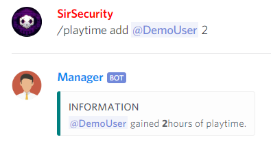

### Playtime Remove


@Manager\#9545 **playtime remove \[user\] \[hours\]**



Remove user playtime


```text
@Manager#9545 playtime remove @SirSecurity#0959 15
```

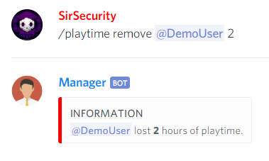

## Warning

### Warning


@Manager\#9545 **warning \[user\] &lt;reason&gt;**



Give user a warning


```text
@Manager#9545 warning @SirSecurity#0959
```

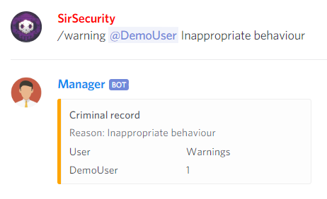

### Warning Show


@Manager\#9545 **warning show &lt;user&gt;**



Show user's warnings


```text
@Manager#9545 warning show
```

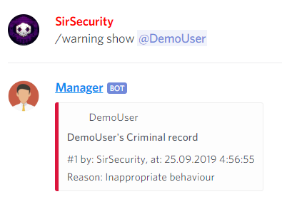

### Warning Clear


@Manager\#9545 **clear \[user\]**



Clear all user warnings


```text
@Manager#9545 clear @SirSecurity#0959
```

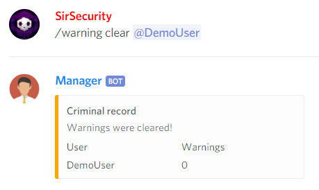

## Punish

### Punish Add


@Manager\#9545 **punish add \[user\] \[minutes\] &lt;reason&gt;**



Prevents user from sending messages and speaking


```text
@Manager#9545 punish add @SirSecurity#0959 10
```

### Punish Remove


@Manager\#9545 **punish remove \[user\] &lt;reason&gt;**



Unpunishes the user


```text
@Manager#9545 punish remove @SirSecurity#0959
```

## Mute

### Mute Voice


@Manager\#9545 **mute voice \[user\] \[minutes\]**



Mutes user's microphone


```text
@Manager#9545 mute voice @SirSecurity#0959
```

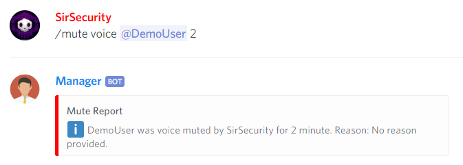

### Mute Chat


@Manager\#9545 **mute chat \[user\] \[minutes\]**



Mutes user's chat


```text
@Manager#9545 mute chat @SirSecurity#0959 5
```

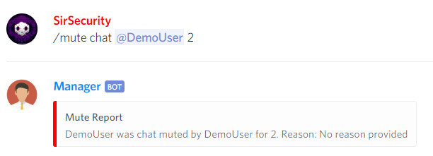

## UnMute

### UnMute Voice


@Manager\#9545 **unmute voice \[user\]**



UnMutes user's microphone


```text
@Manager#9545 unmute voice @SirSecurity#0959
```

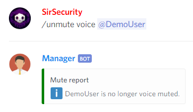

### UnMute Chat


@Manager\#9545 **unmute chat \[user\]**



UnMutes user's chat


```text
@Manager#9545 unmute chat @SirSecurity#0959
```

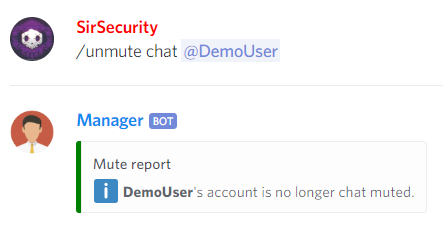

## AFK

### AFK Warn


@Manager\#9545 **afk warn \[user\]**



Gives user an afk warning


```text
@Manager#9545 afk warn @SirSecurity#0959
```

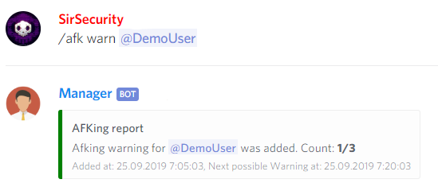

### AFK No


@Manager\#9545 **afk no**



Gives user an afk warning


```text
@Manager#9545 afk no
```

### AFK Remove


@Manager\#9545 **afk remove \[user\]**



Removes user all afk warnings


```text
@Manager#9545 afk remove @SirSecurity#0959
```

### AFK Show


@Manager\#9545 **afk show &lt;user&gt;**



Show user's all afk warnings


```text
@Manager#9545 afk show
```

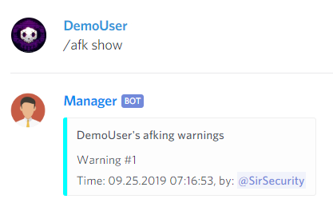

### AFK Settings


@Manager\#9545 **afk settings**



Show current afk policies


```text
@Manager#9545 afk settings
```

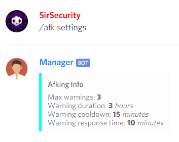

### AFK Edit

